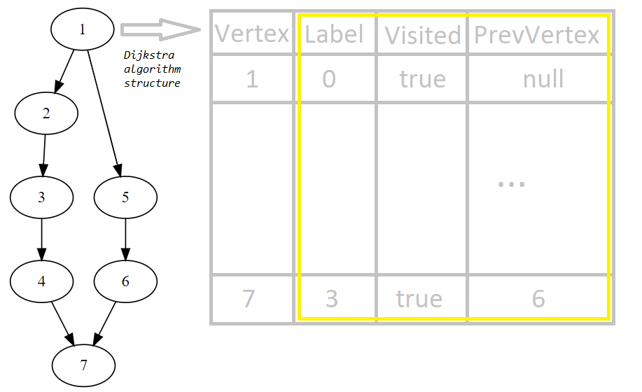

# Description and usage
The project contains a simple graph library. It has following functionality:
* adding vertices
* adding edges
* finding a path between two vertices. According to implementation resulted path is the shortest one.

## Getting path between two vertices
Path calculation is based on Dijkstra algorithm (with some improvements allowing to find path from some vertex to itself).
Data structure described below is built and linked to the search start vertex.
Search results are considered as actual to avoid redundant calculations in case graph isn't changed.

#Example
'
        iGraph<String> friendsGraph = new Graph<String>("Friends", false);

        String person1 = "Monica";
        String person2 = "Phoebe";
        String person3 = "Joey";
        String person4 = "Chandler";
        String person5 = "Rachel";
        String person6 = "Ross";
        String person7 = "Someone";

        try {

            //adding friends
            friendsGraph.addVertex(person1);
            friendsGraph.addVertex(person2);
            friendsGraph.addVertex(person3);
            friendsGraph.addVertex(person4);
            friendsGraph.addVertex(person5);
            friendsGraph.addVertex(person6);
            friendsGraph.addVertex(person7);

            //add friendship
            friendsGraph.addEdge(person1, person2);
            friendsGraph.addEdge(person2, person3);
            friendsGraph.addEdge(person3, person4);
            friendsGraph.addEdge(person4, person7);
            friendsGraph.addEdge(person1, person5);
            friendsGraph.addEdge(person5, person6);
            friendsGraph.addEdge(person6, person7);

            // printing the graph using DOT graph language format
            System.out.println(friendsGraph);

            // finding path between vertices
            Path<String> path = new Path(friendsGraph.getPath(person1, person7));
            // printing path in human readable format
            System.out.println(path);

        } catch (ItemExistsException | ItemNotFoundException ex) {
            System.err.println(ex.getMessage());
        }
'

# Javadoc

To generate java documention execute:

`mvn javadoc:javadoc`

# Usage

To run the tests and view the coverage execute:

`mvn verify`

View tests execution status:

`target/surefire-reports/index.html`

View coverage results:

`target/site/jacoco/index.html`

# Components and tools used:

## Test framework

TestNG - https://testng.org

maven-surefire-plugin - to execute the unit tests

## Code coverage

jacoco-maven-plugin - https://www.eclemma.org/jacoco/trunk/doc/maven.html